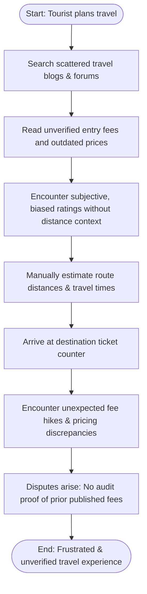

# AS-IS Workflow - Existing Manual Tourist Search Process

```mermaid
flowchart TD
A([Start: Tourist plans travel]) --> B[Search scattered travel blogs & forums]
B --> C[Read unverified entry fees and outdated prices]
C --> D[Encounter subjective, biased ratings without distance context]
D --> E[Manually estimate route distances & travel times]
E --> F[Arrive at destination ticket counter]
F --> G[Encounter unexpected fee hikes & pricing discrepancies]
G --> H[Disputes arise: No audit proof of prior published fees]
H --> I([End: Frustrated & unverified travel experience])
```

