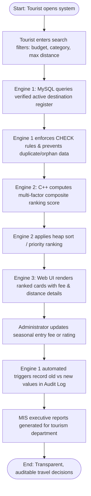

# TO-BE Workflow - Tourist Place Search and Ranking System

```mermaid
flowchart TD
A([Start: Tourist opens system]) --> B[Tourist enters search filters: budget, category, max distance]
B --> C[Engine 1: MySQL queries verified active destination register]
C --> D[Engine 1 enforces CHECK rules & prevents duplicate/orphan data]
D --> E[Engine 2: C++ computes multi-factor composite ranking score]
E --> F[Engine 2 applies heap sort / priority ranking]
F --> G[Engine 3: Web UI renders ranked cards with fee & distance details]
G --> H[Administrator updates seasonal entry fee or rating]
H --> I[Engine 1 automated triggers record old vs new values in Audit Log]
I --> J[MIS executive reports generated for tourism department]
J --> K([End: Transparent, auditable travel decisions])
```

